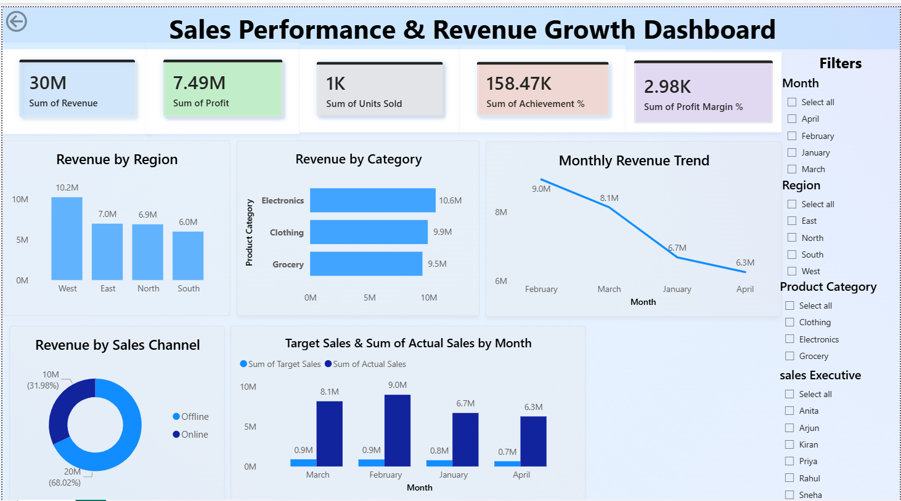

# 📊 Sales Performance & Revenue Growth Dashboard (Power BI)

## 🧾 Project Overview
This project is an interactive **Power BI Sales Analytics Dashboard** designed to analyze sales performance, revenue growth, profit trends, and business KPIs across regions, products, and sales channels.

It provides a real-world business intelligence solution used by sales managers and business analysts to make data-driven decisions.

---

## 🎯 Objective
To build an interactive dashboard that tracks:
- Sales performance
- Revenue growth trends
- Profitability analysis
- Target vs actual sales comparison
- Region and product performance

---

## 🏢 Business Use Case
Organizations use this type of dashboard to:
- Monitor daily/monthly sales performance
- Identify top-performing regions and products
- Track achievement against sales targets
- Improve decision-making for business growth
- Optimize sales strategy and marketing efforts

---

## 🛠️ Tools & Technologies Used
- Power BI Desktop
- Power Query (Data Cleaning & Transformation)
- DAX (Data Analysis Expressions)
- Excel / CSV Dataset

---

## 📂 Dataset Description
The dataset contains sales transaction-level data with the following columns:

- Date, Month, Quarter, Year
- Region, City
- Sales Executive Name
- Product Category, Product Name
- Units Sold, Selling Price
- Revenue, Cost, Profit
- Profit Margin %
- Customer Type (New/Existing)
- Sales Channel (Online/Offline)
- Target Sales, Actual Sales
- Achievement %, Growth %

---

## ⚙️ Power Query Steps
- Removed null and duplicate values  
- Changed data types (Date, Number, Text)  
- Renamed columns for clarity  
- Created Month, Quarter, and Year columns  
- Standardized revenue and profit fields  
- Formatted percentage and currency fields  

---

## 📊 DAX Measures Used
- Total Revenue  
- Total Profit  
- Total Units Sold  
- Profit Margin %  
- Target Sales  
- Actual Sales  
- Achievement %  
- Growth %  
- Region-wise Revenue  
- Category-wise Performance  
- Sales Executive Performance  

---

## 📈 Dashboard Features
- KPI Cards (Revenue, Profit, Growth %, Achievement %)  
- Revenue by Region (Column Chart)  
- Product Category Performance (Bar Chart)  
- Monthly Revenue Trend (Line Chart)  
- Sales Channel Distribution (Donut Chart)  
- Target vs Actual Sales (Clustered Column Chart)  
- Detailed Matrix (Region, Profit, Achievement %)  
- Interactive Slicers (Region, Category, Channel, Month)  

---

## 💡 Key Business Insights
- Identified top-performing regions generating maximum revenue  
- Found most profitable product categories  
- Analyzed sales target achievement levels  
- Observed monthly revenue growth trends  
- Compared performance between online and offline channels  
- Highlighted top sales executives based on performance  

---

## 📂 Dataset

📊 Download Dataset:  
https://github.com/YOUR-USERNAME/Sales-Dashboard-PowerBI/blob/main/sales_dashboard_dataset.xlsx

## 📁 Power BI File

📊 Download PBIX File:  
https://github.com/YOUR-USERNAME/Sales-Dashboard-PowerBI/blob/main/Sales%20Performance%20%26%20Revenue%20Growth%20Dashboard.pbix

## 🖼️ Dashboard Preview

